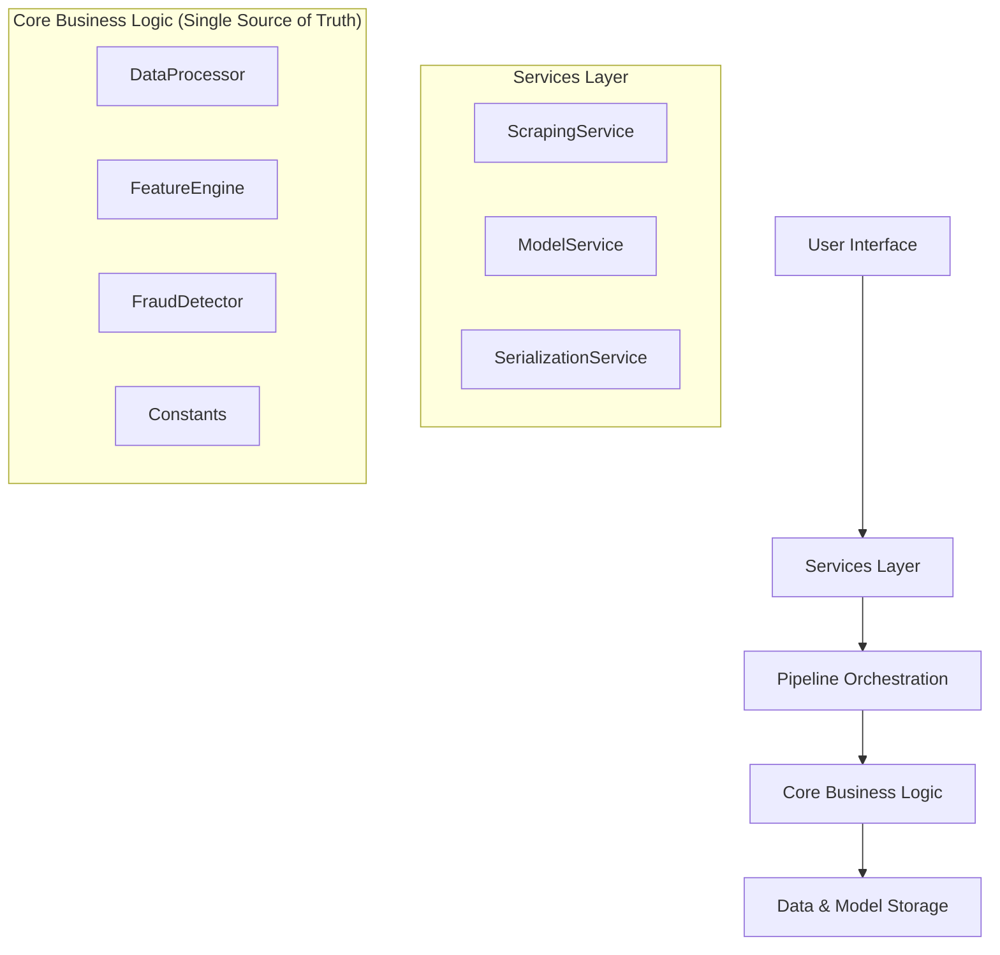

# 🛠️ FraudSpot Development Guide

**Comprehensive Developer Guide for v3.0.0 DRY Architecture**

This guide provides everything developers need to understand, contribute to, and extend FraudSpot's modern architecture built on DRY (Don't Repeat Yourself) consolidation principles.

---

## 📋 Table of Contents

1. [Architecture Overview](#architecture-overview)
2. [Development Environment Setup](#development-environment-setup)
3. [Core Module Development](#core-module-development)
4. [Service Layer Development](#service-layer-development)
5. [Adding New Features](#adding-new-features)
6. [Testing & Quality Assurance](#testing--quality-assurance)
7. [Data Pipeline Development](#data-pipeline-development)
8. [Model Training & Evaluation](#model-training--evaluation)
9. [UI Development](#ui-development)
10. [Deployment & Production](#deployment--production)

---

## 🏗️ Architecture Overview

### DRY Consolidation Principles

FraudSpot v3.0.0 follows strict **Single Source of Truth** patterns:



### Key Architectural Decisions

1. **No Code Duplication**: All business logic consolidated into `src/core/` modules
2. **Service Coordination**: Services orchestrate but don't contain business logic
3. **Pipeline Management**: Centralized workflow orchestration through PipelineManager
4. **Unified Schema**: 32-column schema across all data sources
5. **Multilingual Support**: Built-in English and Arabic processing capabilities

---

## 🚀 Development Environment Setup

### Prerequisites

- create .env file in root folder 
```
# Environment Configuration for Job Fraud Detector
ENVIRONMENT=local
USE_BROWSERLESS=true
BROWSERLESS_API_KEY="BROWSERLESS_KEY"
LOG_LEVEL=INFO
BD_API_KEY="BRIGHT_DAY_KEY"
# For cloud deployment, change to:
# ENVIRONMENT=cloud
# USE_BROWSERLESS=true
# BROWSERLESS_API_KEY=your_actual_key
```
- Python 3.8+
- Git
- Chrome browser (for web scraping)
- Virtual environment support

### Initial Setup

```bash
# Clone and enter project
git clone <repository-url>
cd machine-learning-project-fraudspot

# Create isolated environment
python -m venv venv
source venv/bin/activate  # Windows: venv\Scripts\activate

# Install all dependencies
pip install -r requirements.txt

# Install development tools
pip install black isort flake8 pytest mypy

# Verify installation
python -c "from src.core import DataProcessor; print('✅ Core modules loaded successfully')"
```

### Development Dependencies

Add to `requirements-dev.txt`:

```
black>=22.0.0
isort>=5.10.0
flake8>=4.0.0
pytest>=7.0.0
mypy>=0.950
pytest-cov>=3.0.0
jupyter>=1.0.0
pre-commit>=2.17.0
```

### IDE Configuration

**VS Code Settings (.vscode/settings.json)**:

```json
{
    "python.defaultInterpreterPath": "./venv/bin/python",
    "python.linting.enabled": true,
    "python.linting.flake8Enabled": true,
    "python.formatting.provider": "black",
    "python.sortImports.args": ["--profile", "black"],
    "editor.formatOnSave": true
}
```

---

## 💎 Core Module Development

### Understanding the Core Architecture

**Core modules (`src/core/`) are the ONLY place for business logic**:

```python
# ✅ CORRECT: All business logic in core modules
from src.core import DataProcessor, FeatureEngine, FraudDetector

processor = DataProcessor()
processed_data = processor.fit_transform(raw_data)

# ❌ WRONG: Business logic outside core modules
def preprocess_data_elsewhere(data):
    # This violates DRY principles
    pass
```

### DataProcessor Development

**Purpose**: Single source of truth for ALL data preprocessing operations.

```python
# src/core/data_processor.py

class DataProcessor:
    def __init__(self, balance_method='smote', scaling_method='standard'):
        """Initialize with configuration from Constants"""
        self.balance_method = balance_method
        self.scaling_method = scaling_method
    
    def fit_transform(self, X, y=None):
        """Main preprocessing pipeline - SINGLE SOURCE OF TRUTH"""
        # Step 1: Clean and validate
        X_clean = self._clean_data(X)
    
        # Step 2: Handle missing values
        X_imputed = self._handle_missing_values(X_clean)
    
        # Step 3: Encode categorical features
        X_encoded = self._encode_categorical(X_imputed)
    
        # Step 4: Scale numerical features
        X_scaled = self._scale_features(X_encoded)
    
        return X_scaled
  
    def _clean_data(self, X):
        """Private method for data cleaning logic"""
        # ALL data cleaning logic here
        pass
```

**Development Guidelines**:

- All preprocessing methods must be in DataProcessor
- Private methods start with `_`
- Use constants from `src/core/constants.py`
- Include comprehensive logging
- Validate all inputs and outputs

### FeatureEngine Development

**Purpose**: Single source of truth for ALL feature engineering operations.

```python
# src/core/feature_engine.py

class FeatureEngine:
    def __init__(self):
        """Initialize with feature configuration"""
        self.feature_names = ModelConstants.REQUIRED_FEATURE_COLUMNS
    
    def generate_complete_feature_set(self, job_data):
        """Generate all 33 features - SINGLE SOURCE OF TRUTH"""
        features = {}
    
        # Text-based features
        features.update(self._generate_text_features(job_data))
    
        # Structural features
        features.update(self._generate_structural_features(job_data))
    
        # Verification features (the "perfect predictors")
        features.update(self._generate_verification_features(job_data))
    
        # Language-aware features
        features.update(self._generate_language_features(job_data))
    
        return pd.DataFrame([features])
  
    def _generate_text_features(self, job_data):
        """Generate text-based features"""
        # ALL text feature logic here
        return {
            'description_length_score': self._calculate_description_score(job_data),
            'professional_language_score': self._calculate_professional_score(job_data),
            # ... more text features
        }
```

**Development Guidelines**:

- All feature generation must be in FeatureEngine
- Features must match the 33-column specification
- Support both English and Arabic text processing
- Include feature importance metadata
- Validate feature ranges (typically 0-1)

### FraudDetector Development

**Purpose**: Single source of truth for ALL fraud detection and prediction logic.

```python
# src/core/fraud_detector.py

class FraudDetector:
    def __init__(self):
        """Initialize fraud detection system"""
        self.model_pipeline = None
        self.verification_thresholds = ModelConstants.VERIFICATION_THRESHOLDS
    
    def predict_fraud(self, job_data, use_ml=True):
        """Main prediction interface - SINGLE SOURCE OF TRUTH"""
        # Step 1: Prepare data for prediction
        if isinstance(job_data, dict):
            # Convert scraped data to ML format using DataProcessor
            ml_ready_data = self._prepare_scraped_data(job_data)
        else:
            ml_ready_data = job_data
        
        # Step 2: Choose prediction method
        if use_ml and self.model_pipeline:
            return self._predict_with_ml(ml_ready_data)
        else:
            return self._predict_with_rules(ml_ready_data)
  
    def _classify_risk_from_verification(self, verification_score):
        """Rule-based classification using verification features"""
        # The "perfect predictor" logic
        if verification_score >= 2.5:
            return 'low', 0.95  # High confidence legitimate
        elif verification_score <= 1.5:
            return 'critical', 0.95  # High confidence fraudulent
        else:
            return 'medium', 0.7  # Uncertain
```

**Development Guidelines**:

- All fraud detection logic must be in FraudDetector
- Support both ML-based and rule-based predictions
- Use verification features as primary indicators
- Return consistent result format
- Include confidence scores and risk levels

---

## 🔧 Service Layer Development

Services coordinate between components but **DO NOT contain business logic**.

### ScrapingService Development

```python
# src/services/scraping_service.py

class ScrapingService:
    def __init__(self):
        """Initialize with core module references"""
        self.data_processor = DataProcessor()  # Use core module
    
    def scrape_job_posting(self, url):
        """Main scraping interface - COORDINATES, doesn't implement"""
        # Step 1: Validate URL
        if not self._validate_linkedin_url(url):
            return {'success': False, 'error': 'Invalid URL'}
    
        # Step 2: Scrape raw data (coordination)
        raw_data = self._scrape_raw_data(url)
    
        # Step 3: Use DataProcessor for standardization
        standardized_data = self.data_processor.prepare_scraped_data_for_ml(raw_data)
    
        return {
            'success': True,
            'data': standardized_data,
            'source': 'linkedin_scraper'
        }
```

### ModelService Development

```python
# src/services/model_service.py

class ModelService:
    def __init__(self):
        """Model lifecycle management service"""
        self.models_dir = Path('models/')
    
    def save_model(self, pipeline, model_name, metadata=None):
        """Save model with metadata - COORDINATES storage"""
        # Use joblib for serialization (coordination)
        # Delegate validation to core modules if needed
    
    def load_model(self, model_name):
        """Load model with validation - COORDINATES loading"""
        # Use joblib for deserialization (coordination)
        # Delegate validation to core modules
    
    def validate_model(self, model_name):
        """Validate model integrity - COORDINATES validation"""
        # Use FraudDetector for validation logic
        detector = FraudDetector()
        return detector.validate_model_compatibility(model_path)
```

**Service Development Guidelines**:

- Services coordinate, core modules implement
- No business logic in services
- Use dependency injection for core modules
- Handle errors and provide consistent APIs
- Focus on orchestration and integration

---

## 🆕 Adding New Features

### Feature Development Workflow

1. **Identify the Core Module**: Determine which core module should contain the logic
2. **Update Core Module**: Add business logic to appropriate core module
3. **Update Services**: Modify services to coordinate new functionality
4. **Update Pipeline**: Integrate into PipelineManager workflow
5. **Update UI**: Add interface elements if needed
6. **Add Tests**: Comprehensive test coverage
7. **Update Documentation**: Document new functionality

### Example: Adding New Text Feature

```python
# Step 1: Add to FeatureEngine (core module)
class FeatureEngine:
    def _generate_text_features(self, job_data):
        features = {
            # ... existing features
            'new_text_feature': self._calculate_new_text_feature(job_data)
        }
        return features
  
    def _calculate_new_text_feature(self, job_data):
        """New feature calculation - ALL logic here"""
        # Implement feature calculation
        pass

# Step 2: Update Constants (core module)
class ModelConstants:
    REQUIRED_FEATURE_COLUMNS = [
        # ... existing columns
        'new_text_feature'  # Add to required columns
    ]

# Step 3: Update tests
def test_new_text_feature():
    engine = FeatureEngine()
    features = engine.generate_complete_feature_set(sample_data)
    assert 'new_text_feature' in features.columns
```

### Adding New Prediction Method

```python
# Step 1: Add to FraudDetector (core module)
class FraudDetector:
    def predict_fraud(self, job_data, use_ml=True, method='standard'):
        if method == 'new_method':
            return self._predict_with_new_method(job_data)
        # ... existing logic
  
    def _predict_with_new_method(self, job_data):
        """New prediction method - ALL logic here"""
        # Implement new prediction logic
        pass

# Step 2: Update PipelineManager (orchestration)
class PipelineManager:
    def predict(self, job_data, method='standard'):
        return self.fraud_detector.predict_fraud(
            job_data, 
            use_ml=(self.pipeline is not None),
            method=method
        )
```

---

## 🧪 Testing & Quality Assurance

### Testing Strategy

```python
# tests/core/test_data_processor.py
import pytest
from src.core import DataProcessor

class TestDataProcessor:
    def setup_method(self):
        """Setup for each test"""
        self.processor = DataProcessor()
    
    def test_fit_transform_basic(self):
        """Test basic preprocessing pipeline"""
        # Test data
        raw_data = pd.DataFrame({
            'job_title': ['Software Engineer', 'Data Analyst'],
            'company_name': ['TechCorp', 'DataInc']
        })
    
        # Process
        result = self.processor.fit_transform(raw_data)
    
        # Assertions
        assert isinstance(result, pd.DataFrame)
        assert len(result) == len(raw_data)
        assert not result.isnull().any().any()
    
    def test_prepare_scraped_data_for_ml(self):
        """Test scraped data conversion to ML format"""
        scraped_data = {
            'job_title': 'Software Engineer',
            'company_name': 'TechCorp',
            # ... scraped format
        }
    
        result = self.processor.prepare_scraped_data_for_ml(scraped_data)
    
        # Should match ML schema
        assert isinstance(result, pd.DataFrame)
        assert len(result.columns) == 32  # 32-column unified schema
```

### Code Quality Tools

```bash
# Format code
black src/
isort src/

# Lint code
flake8 src/

# Type checking
mypy src/

# Run tests with coverage
pytest --cov=src tests/

# Pre-commit hooks
pre-commit install
pre-commit run --all-files
```

### Quality Gates

Before committing code:

1. ✅ All tests pass
2. ✅ Code coverage ≥95%
3. ✅ No linting errors
4. ✅ Type checking passes
5. ✅ Documentation updated
6. ✅ Core modules contain all business logic
7. ✅ No code duplication
8. ✅ Services only coordinate, don't implement

---

## 📊 Data Pipeline Development

### Understanding the Data Flow

```python
# Data flow in v3.0.0 architecture
raw_data/
├── fake_job_postings.csv (English, 17,880 samples)
└── Jadarat_data.csv (Arabic, 2,023 samples)
    ↓
notebooks/rebuild_multilingual_dataset.ipynb
    ↓ (standardization and combination)
processed/
└── multilingual_job_fraud_data.csv (Combined, 19,903 samples)
    ↓
DataProcessor (core module)
    ↓ (preprocessing and feature engineering)
FeatureEngine (core module)
    ↓ (33-column feature set)
ML Models (training/prediction)
```

### Working with the Multilingual Dataset

```python
from src.core import DataProcessor, FeatureEngine
import pandas as pd

# Load the standardized dataset
data = pd.read_csv('data/processed/multilingual_job_fraud_data.csv')

# Verify schema compliance
processor = DataProcessor()
is_valid = processor.validate_dataframe(data)
print(f"Dataset valid: {is_valid}")

# Generate features
engine = FeatureEngine()
features = engine.generate_complete_feature_set(data.iloc[0])
print(f"Generated {len(features.columns)} features")
```

### Creating New Datasets

```python
def create_custom_dataset():
    """Example: Creating a new dataset for training"""
  
    # Step 1: Load raw data
    english_data = pd.read_csv('data/raw/fake_job_postings.csv')
    arabic_data = pd.read_csv('data/raw/Jadarat_data.csv')
  
    # Step 2: Use DataProcessor for standardization
    processor = DataProcessor()
  
    english_standardized = processor.standardize_to_schema(english_data)
    arabic_standardized = processor.standardize_to_schema(arabic_data)
  
    # Step 3: Combine datasets
    combined_data = processor.combine_datasets(
        [english_standardized, arabic_standardized],
        language_labels=[0, 1]  # 0=English, 1=Arabic
    )
  
    # Step 4: Save processed dataset
    combined_data.to_csv('data/processed/custom_dataset.csv', index=False)
  
    return combined_data
```

---

## 🤖 Model Training & Evaluation

### Using PipelineManager for Training

```python
from src.pipeline import PipelineManager

def train_custom_model():
    """Example: Custom model training workflow"""
  
    # Initialize pipeline with configuration
    pipeline = PipelineManager(
        model_type='random_forest',
        balance_method='smote',
        scaling_method='standard',
        config={
            'random_state': 42,
            'test_size': 0.2,
            'cv_folds': 5
        }
    )
  
    # Load and prepare data
    pipeline.load_data('data/processed/multilingual_job_fraud_data.csv')
    X_train, X_test, y_train, y_test = pipeline.prepare_data()
  
    # Train model
    training_results = pipeline.train_model(X_train, y_train)
    print(f"Training F1 Score: {training_results['f1_score']:.3f}")
  
    # Evaluate on test set
    eval_results = pipeline.evaluate_model(X_test, y_test)
    print(f"Test F1 Score: {eval_results['f1_score']:.3f}")
  
    # Build and save deployment pipeline
    deployment_pipeline = pipeline.build_pipeline()
    pipeline.save_pipeline('my_custom_model')
  
    return pipeline
```

### Model Comparison and Selection

```python
def compare_models():
    """Example: Comparing multiple model types"""
  
    models = ['random_forest', 'svm', 'logistic_regression', 'naive_bayes']
    results = {}
  
    for model_type in models:
        print(f"\nTraining {model_type}...")
    
        pipeline = PipelineManager(
            model_type=model_type,
            balance_method='smote'
        )
    
        # Load data and train
        pipeline.load_data('data/processed/multilingual_job_fraud_data.csv')
        X_train, X_test, y_train, y_test = pipeline.prepare_data()
    
        training_results = pipeline.train_model(X_train, y_train)
        eval_results = pipeline.evaluate_model(X_test, y_test)
    
        results[model_type] = {
            'training_f1': training_results['f1_score'],
            'test_f1': eval_results['f1_score'],
            'test_accuracy': eval_results['accuracy'],
            'training_time': training_results.get('training_time', 0)
        }
    
        # Save best performing model
        if eval_results['f1_score'] > 0.93:  # High performance threshold
            pipeline.save_pipeline(f'high_performance_{model_type}')
  
    # Display comparison
    results_df = pd.DataFrame(results).T
    print("\nModel Comparison:")
    print(results_df.round(3))
  
    return results_df
```

---

## 🎨 UI Development

### Streamlit App Architecture

```python
# main.py - Clean separation using core modules

import streamlit as st
from src.services import ScrapingService, ModelService  
from src.pipeline import PipelineManager
from src.ui import UIOrchestrator

def main():
    """Main Streamlit application"""
  
    # Initialize services (coordination layer)
    scraper = ScrapingService()
    model_service = ModelService()
  
    # Initialize pipeline (orchestration layer)
    pipeline = PipelineManager()
  
    # Load latest model if available
    available_models = model_service.get_available_models()
    if available_models:
        best_model = available_models[0]['name']  # Assume sorted by performance
        pipeline.load_pipeline(best_model)
  
    # Use UI orchestrator (coordination layer)
    ui = UIOrchestrator(scraper, pipeline)
    ui.render_main_interface()

if __name__ == "__main__":
    main()
```

### UI Components Development

```python
# src/ui/components/analysis_display.py

import streamlit as st
import plotly.graph_objects as go
from typing import Dict, Any

def render_fraud_analysis(prediction_result: Dict[str, Any]):
    """Render fraud analysis results"""
  
    # Extract results
    risk_level = prediction_result.get('risk_level', 'unknown')
    confidence = prediction_result.get('confidence', 0)
    verification_score = prediction_result.get('verification_score', 0)
  
    # Main risk indicator
    col1, col2, col3 = st.columns([2, 2, 2])
  
    with col1:
        st.metric(
            label="🎯 Risk Level",
            value=risk_level.upper(),
            delta=f"{confidence:.1%} confidence"
        )
  
    with col2:
        st.metric(
            label="🏆 Verification Score", 
            value=f"{verification_score}/4",
            delta="Perfect predictor" if verification_score >= 2.5 else "Suspicious pattern"
        )
  
    with col3:
        fraud_prob = prediction_result.get('fraud_probability', 0)
        st.metric(
            label="⚠️ Fraud Probability",
            value=f"{fraud_prob:.1%}",
            delta="High risk" if fraud_prob > 0.7 else "Low risk"
        )
  
    # Verification details
    if 'verification_details' in prediction_result:
        render_verification_breakdown(prediction_result['verification_details'])
  
    # Feature importance (if available)
    if 'feature_importance' in prediction_result:
        render_feature_importance(prediction_result['feature_importance'])

def render_verification_breakdown(verification_details: Dict[str, Any]):
    """Render detailed verification analysis"""
  
    st.subheader("🔍 Verification Analysis")
  
    verification_items = [
        ('poster_verified', 'Account Verified', 'Poster has verified LinkedIn account'),
        ('poster_experience', 'Relevant Experience', 'Poster has experience in the industry'),
        ('poster_photo', 'Profile Photo', 'Poster has a professional profile photo'),
        ('poster_active', 'Recent Activity', 'Poster has recent account activity')
    ]
  
    for key, label, description in verification_items:
        value = verification_details.get(key, 0)
        icon = "✅" if value == 1 else "❌"
    
        st.write(f"{icon} **{label}**: {description}")
    
        # Statistical context
        if value == 1:
            st.caption("✅ 96.7% of real jobs have this verification")
        else:
            st.caption("🚨 94.5% of fake jobs lack this verification")
```

### Adding New UI Features

1. **Create component in `src/ui/components/`**
2. **Use services for data access, not core modules directly**
3. **Focus on presentation and interaction**
4. **Include proper error handling and loading states**
5. **Follow consistent design patterns**

---

## 📝 Development Best Practices

### Code Organization Principles

1. **Single Responsibility**: Each core module has one clear purpose
2. **DRY Compliance**: No duplicate business logic anywhere
3. **Service Coordination**: Services orchestrate, don't implement
4. **Clear Interfaces**: Consistent APIs across all modules
5. **Comprehensive Testing**: 95%+ test coverage requirement

### Documentation Standards

```python
def example_function(data: pd.DataFrame, config: Dict[str, Any]) -> pd.DataFrame:
    """
    Brief description of what the function does.
  
    This function demonstrates the documentation standard for FraudSpot.
    All functions should include comprehensive docstrings following this format.
  
    Args:
        data (pd.DataFrame): Input DataFrame with job posting data
        config (Dict[str, Any]): Configuration dictionary with processing options
    
    Returns:
        pd.DataFrame: Processed DataFrame with standardized schema
    
    Raises:
        ValueError: If data is empty or invalid
        KeyError: If required configuration keys are missing
    
    Example:
        >>> processor = DataProcessor()
        >>> config = {'method': 'standard'}
        >>> result = processor.example_function(data, config)
        >>> print(result.shape)
        (1000, 32)
    
    Note:
        This function is part of the DataProcessor core module and follows
        DRY principles by being the single source of truth for this operation.
    """
    # Implementation here
    pass
```

### Error Handling Patterns

```python
import logging
from typing import Optional, Union, Dict, Any

logger = logging.getLogger(__name__)

def robust_function(data: pd.DataFrame) -> Union[pd.DataFrame, Dict[str, Any]]:
    """Example of robust error handling in core modules"""
  
    try:
        # Validate inputs
        if data.empty:
            raise ValueError("Empty DataFrame provided")
    
        # Core processing logic
        result = self._process_data(data)
    
        # Validate outputs
        if not self._validate_result(result):
            raise ValueError("Processing produced invalid result")
    
        logger.info(f"Successfully processed {len(data)} records")
        return result
    
    except ValueError as e:
        logger.error(f"Validation error in {self.__class__.__name__}: {str(e)}")
        return {
            'success': False,
            'error': str(e),
            'error_type': 'validation'
        }
    
    except Exception as e:
        logger.error(f"Unexpected error in {self.__class__.__name__}: {str(e)}")
        return {
            'success': False,
            'error': 'Internal processing error',
            'error_type': 'internal'
        }
```

---


### Review Checklist

- [ ] All business logic is in `src/core/` modules
- [ ] Services only coordinate, don't contain logic
- [ ] No code duplication anywhere
- [ ] Comprehensive test coverage (≥95%)
- [ ] Type hints on all public functions
- [ ] Comprehensive docstrings
- [ ] Error handling follows established patterns
- [ ] Integration with existing components verified
- [ ] Performance impact assessed
- [ ] Documentation updated

**🎯 Remember**: FraudSpot v3.0.0 is built on DRY principles. All business logic goes in `src/core/` modules. Services coordinate. No duplication. Single source of truth always.

*Happy coding! 🚀*
